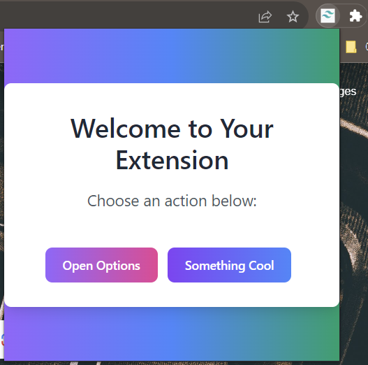
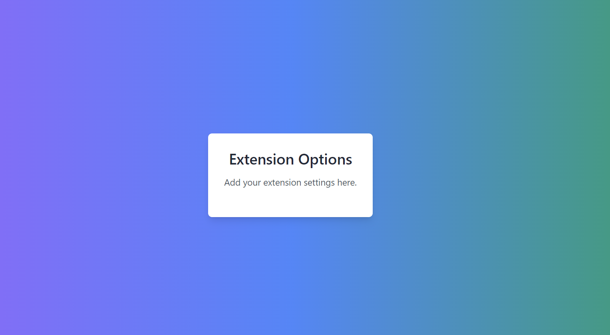

<h1 align="center">Chrome Extension with Tailwind CSS and Flowbite</h1>

<p align="center">
  <em>Unlock the Power of Stylish Chrome Extensions</em>
</p>
<p align="center">
  <a href="https://github.com/prnvbn/tailwind-flowbite-chrome-extension">
    
  </a>
</p>
## Overview

This is a sample Chrome extension that demonstrates how to use [TailwindCSS](https://tailwindcss.com/), a utility-first CSS framework, and [Flowbite](https://flowbite.com/), a UI components library based on TailwindCSS, to create a stylish chrome extension. [PostCSS](https://postcss.org/) has also been added

**Looks:**

|              Popup Page              |               Options Pag                |
| :----------------------------------: | :--------------------------------------: |
|  |  |

## Installation

### Local Development

1. Clone or download this repository to your local machine.

```bash
git clone https://github.com/prnvbn/tailwind-flowbite-chrome-extension.git
```

2. Install dependencies: `npm install` or `yarn`

3. Build the extension: `npm run build` or `yarn build`. This populates the `extention/dist` folder.

### Local Testing (on Chrome)

1. Navigate to `chrome://extensions` in Chrome;
2. Enable the Developer mode (upper right toggle button)
3. Click on Load unpacked extension (upper left navigation bar)
4. Upload the extension folder

## Features

- TailwindCSS setup
- Flowbite setup
- Webpack setup
- PostCSS setup
- Starter options and popup pages
- Sensible folder structur

## Contributing

Feel free to fork the repo and create a PR for any contributions :)
